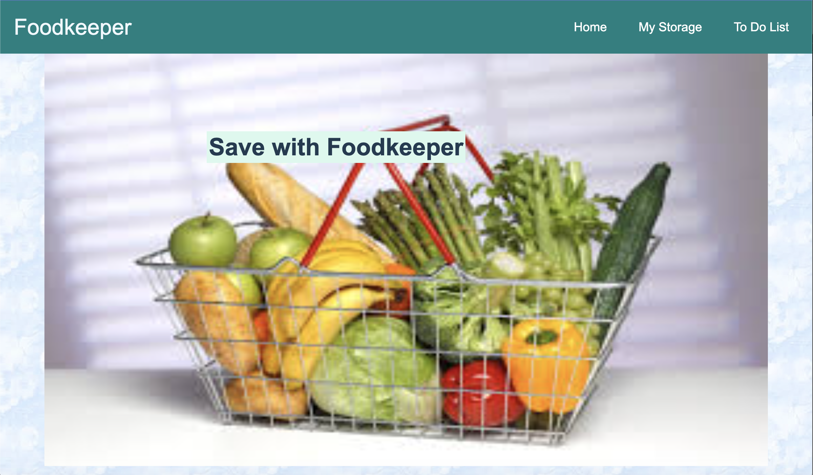
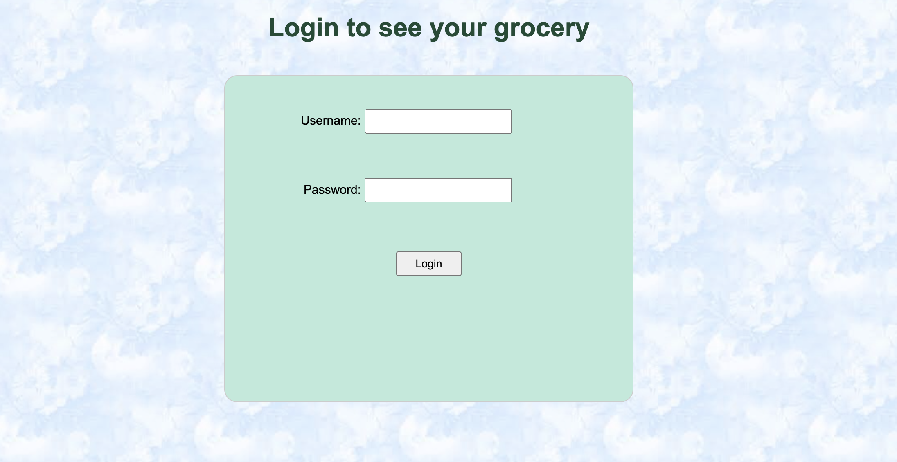
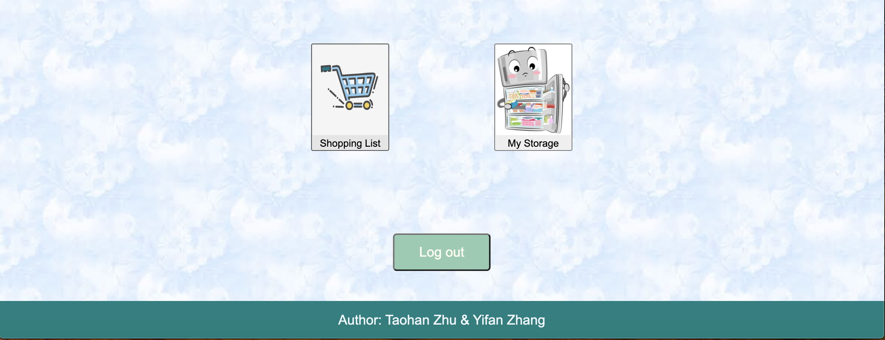
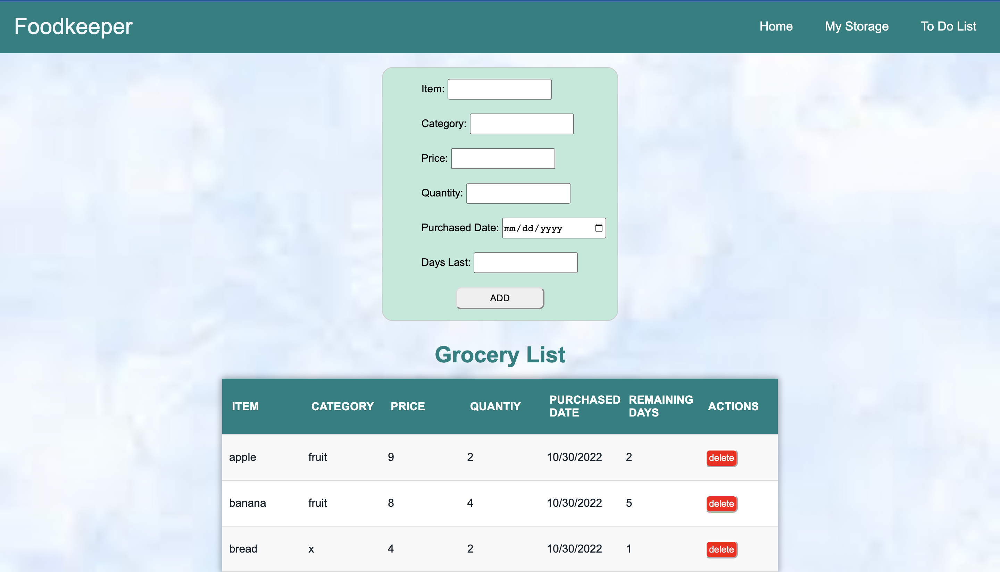
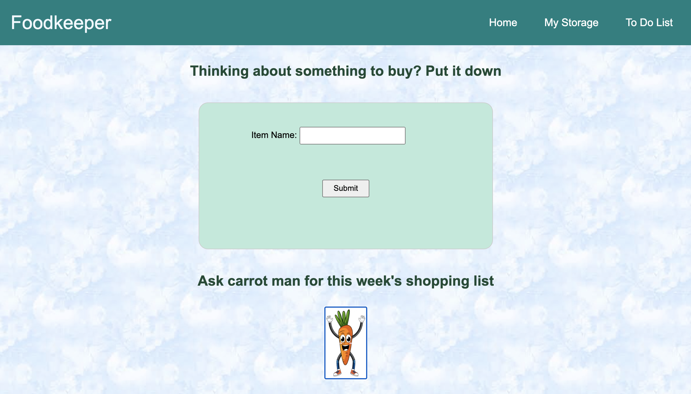

# Project 2: Personalized grocery shopping list and storage list

### Authors:

- Taohan Zhu and Yifan Zhang

### Class Link:

- [Northeastern University CS5610](https://johnguerra.co/lectures/webDevelopment_fall2022/)

### Web App URL:

- Heroku: [Foodkeeper](https://foodkeeper-cs5610.herokuapp.com/)

## Project Objective

In this project, we developed a web application that aims to help users keep track of their groceries. This app allows users to keep track of both remaining groceries (storage list) at home and shopping list for future. Users are also allowed to sort the storage list based on price, quantity, purchased date, and remaining days. We have utilized tech stacks of Node.js and Express for the backend and set up a MongoDB database with 3 collections.

- Home Page
  
  
  

- My Storage Page
  

- Shopping List Page
  
  

## Instructions to build

- Clone this git repository to your local computer
- Open the working directory and install all required dependencies with `npm install`
- Run command `node app.js` to start your local server
- Open your browser and go to `localhost:7777` to see the website page
